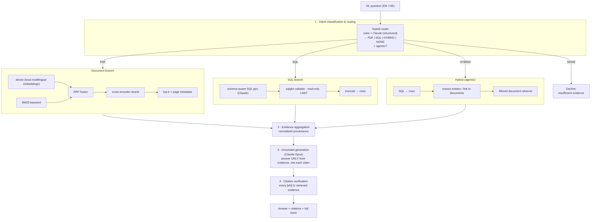

# AI Business Knowledge Assistant

**A multi-source retrieval & orchestration engine — not a PDF chatbot.**

It answers free-form business questions by *deciding which source(s) are relevant*,
retrieving from **PDF documents** and a **SQLite database** (or both), combining the
evidence, and producing a **grounded answer with verified citations** — and it shows
you **every step** of how it got there.

```
Question → Intent routing → Per-source retrieval (hybrid) → Evidence aggregation
        → Grounded generation → Citation verification → Answer + full trace
```

English **and** Hebrew. Designed so future **CRM / email / cloud-storage** sources plug in
without touching the pipeline.

> 📄 **New here? Start with the [System Overview](docs/overview.md)** ([PDF](docs/AI_Business_Assistant_Overview.pdf)) — a screenshot walkthrough of what it does and how it works.

---

## The distinction this demo makes visible

| ❌ A PDF chatbot | ✅ This engine |
|---|---|
| PDF → embed → vector search → answer | Question → **route** → **per-source hybrid retrieval** → **evidence aggregation** → **grounded answer** → **verified citations** |
| One opaque "trust me" answer | An **inspector panel**: route + reasoning, dense/BM25 ranks, RRF + rerank, generated SQL, timings, cost, citation check |
| A single search | **Agentic hybrid**: SQL finds the rows → those entities *filter* document retrieval → a combined, cited answer |
| Confidently answers anything | Says **"insufficient evidence"** when no source can answer |

The flagship question — *"Which customers have overdue invoices, and what do their
agreements say about service suspension?"* — runs SQL to find the overdue customers,
**links them to their specific contract PDFs**, retrieves the suspension clauses from
*only those documents*, and answers with mixed database + document citations. No
vector-search wrapper can produce that trace.

---

## Architecture



**Extensibility:** every source implements one `Source` interface (`describe()` +
`retrieve()`). The repo ships a stubbed `CrmSource` (marked *future*) to make the point
concrete — adding CRM/email/cloud storage is a new implementation, **not** a pipeline
rewrite. See [docs/architecture.md](docs/architecture.md).

---

## Quickstart

### Option A — Docker (one command)

```bash
# optional: live Claude answers
echo "ANTHROPIC_API_KEY=sk-ant-..." > .env

docker compose up --build
```

- UI  → http://localhost:3000
- API → http://localhost:8000  (OpenAPI docs at `/docs`)

No key? It still runs — **offline mode** uses deterministic routing/SQL/answers so the
whole pipeline (and every citation) stays demonstrable. Embeddings are a **local model**,
so they never need a key.

### Option B — Local (two terminals)

```bash
# 1) backend
python3 -m venv .venv && . .venv/bin/activate
pip install -r requirements.txt
python scripts/seed_data.py && python scripts/make_pdfs.py   # build demo corpus + DB
uvicorn app.main:app --reload --port 8000

# 2) frontend
cd ui && npm install && NEXT_PUBLIC_API_BASE=http://localhost:8000 npm run dev
```

`make help` lists shortcuts (`make seed`, `make api`, `make ui`, `make eval`).

---

## Try these (preloaded in the UI)

| # | Question | Route | What it proves |
|---|---|---|---|
| 1 | What is the total outstanding invoice amount per customer? | **SQL** | Clean generated SQL, table/row citations |
| 2 | What do our contracts say about service suspension? | **PDF** | Hybrid retrieval + page citations |
| 3 | Which contract clauses mention SLA-2025? | **PDF** | **BM25** finds the exact ID embeddings miss |
| 4 | Which customers have overdue invoices, and what do their agreements say about service suspension? | **HYBRID** | **Agentic**: SQL → linked contracts → grounded combined answer |
| 5 | What contracts expire in the next 90 days, and what penalties do they define? | **HYBRID** | Date filter (SQL) + penalty clauses (PDF) |
| 6 | Show all active projects and summarize the risks in their documentation. | **HYBRID** | SQL projects + per-project risk narrative |
| 7 | מה אומר ההסכם של תבור מערכות על השעיית שירות וקנסות? | **PDF** | Bilingual retrieval over a Hebrew contract (RTL) |
| 8 | What is our employee headcount in Berlin? | **NONE** | Honest "insufficient evidence" |

Run them all: `make eval` (works offline; checks route, evidence, and citation verification).

---

## Traceability — the core selling point

Every answer carries a complete, inspectable `trace`:

- **Route** — decision, reasoning, confidence, agentic flag, sub-queries.
- **Orchestrator narration** — the actual step-by-step (e.g. *"linked 3 customers → 3 contract documents; restricting document retrieval to them"*).
- **SQL** — the exact validated read-only query, the tables, the returned rows.
- **Document retrieval** — every candidate with its **dense rank, BM25 rank, RRF score, rerank score**, and whether it was selected.
- **Evidence** — the single source of truth: each item shows source type, document + page + chunk **or** table + row + SQL.
- **Citation check** — every `[eN]` in the answer is verified to trace to retrieved evidence.
- **Cost & timings** — tokens and USD per answer (embeddings are local → $0).

Click any citation in the UI to jump to and highlight the exact evidence.

---

## Technology choices (and why)

| Concern | Choice | Why |
|---|---|---|
| Generation / routing / SQL | **Anthropic Claude** (provider-agnostic interface) | Strong structured output + multilingual + grounded behavior. Opus for answers, Sonnet for routing/SQL. Swappable in one file. |
| Embeddings | **Local multilingual** (BGE-M3 / e5) with hashing fallback | Offline, no key, strong Hebrew. The fallback keeps the repo runnable before the model is downloaded. |
| Vector store | **Pluggable**: NumPy (default) + **Qdrant** adapter | Reinforces the thesis: *orchestration matters more than the vector DB*. Qdrant is a one-flag swap. |
| Keyword search | **BM25** | Catches exact identifiers (`SLA-2025`) embeddings miss — true hybrid. |
| Fusion / rerank | **RRF** + optional **cross-encoder** | Robust, and easy to *show* in the inspector. |
| SQL safety | **sqlglot** AST validation, read-only, LIMIT, timeout | The model never touches the DB; SELECT-only, allow-listed tables. |
| UI | **FastAPI + Next.js** | API-first engine; a polished, inspector-first frontend. |
| Offline mode | deterministic fallbacks + response cache | The demo never breaks on a missing key or network. |

**Cost:** ~**$0.02–0.03 per question** with Opus answers (~$0.01 with Sonnet). Embeddings
are local → **$0**. The full 8-question demo ≈ **$0.20**. A single pay-as-you-go API key is
all that's needed — no Claude Max subscription (that powers Claude.ai/Code, not this API).

**LLM provider is swappable (incl. free options).** The engine is provider-agnostic. Set
`ABA_LLM_PROVIDER=openai` to use **any OpenAI-compatible endpoint** — and several are free:

| Provider | Cost | `ABA_OPENAI_BASE_URL` | Example model |
|---|---|---|---|
| **Groq** | free (no card) | `https://api.groq.com/openai/v1` | `llama-3.3-70b-versatile` |
| **Google Gemini** | free tier | `https://generativelanguage.googleapis.com/v1beta/openai/` | `gemini-2.0-flash` |
| **Ollama** (local) | free | `http://localhost:11434/v1` | `llama3.1` |
| OpenAI | paid | `https://api.openai.com/v1` | `gpt-4o` |
| Anthropic (default) | paid | — | `claude-opus-4-8` |

See `.env.example` for copy-paste configs. With **no key at all**, the demo runs in
deterministic **offline mode** ($0) — the routing/retrieval/traceability inspector is
identical; only the final answer wording is extractive instead of model prose.

---

## Project structure

```
app/
  api/            FastAPI routes (/ask, /trace, /examples, /sources, /config, /health)
  ingestion/      pdf.py (extract + RTL-normalize + section-aware chunk), sqlite_introspect.py
  retrieval/      vector_store.py (numpy + qdrant), bm25.py, fusion.py, rerank.py, document_retriever.py
  sql/            generate.py, validate.py (sqlglot), execute.py (read-only)
  sources/        base.py (Source interface), document_source.py, relational_source.py, crm_source.py (future)
  routing/        classify.py (rules + Claude), orchestrator.py (the agentic engine)
  generation/     generate.py (grounded), verify.py (citation check)
  llm/            client.py (provider-agnostic + offline cache), embeddings.py (local + fallback)
  pricing.py      per-answer token cost
ui/               Next.js inspector frontend
scripts/          seed_data.py, make_pdfs.py, eval.py
data/             business.db + pdfs/ (committed; regenerate any time)
docs/             overview.md, architecture.md, images/ (system overview + screenshots)
```

---

## Notes

- **Hebrew/RTL:** PDF extractors return Hebrew runs in visual (reversed) order; the
  ingestion layer restores logical order so the index matches logical-order queries. The
  UI renders Hebrew answers and citations right-to-left.
- **Demo data is synthetic** and dated relative to **2026-06-08**, so "expiring in 90 days"
  and "overdue" are always live. Regenerate with `scripts/seed_data.py` + `scripts/make_pdfs.py`.
- **Out of scope (deliberately):** auth, billing, user management. This is a focused
  demonstration of routing, retrieval quality, grounding, and traceability.

See [docs/overview.md](docs/overview.md) for a screenshot walkthrough and
[docs/architecture.md](docs/architecture.md) for the architecture deep dive.
