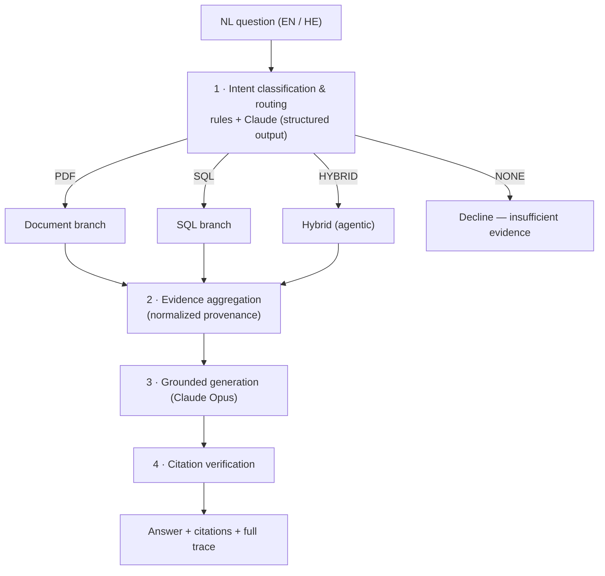

# Architecture — AI Business Knowledge Assistant

A client-facing deep dive into how the system turns a question into a grounded,
cited answer — and why it is an *orchestration engine*, not a PDF chatbot.

---

## 1. Request lifecycle



Every stage writes to a single `Trace` object that the UI renders in full — there is no
hidden state between "the model said so" and "here is exactly why."

---

## 2. The four stages

### 2.1 Routing (`app/routing/classify.py`)

A **hybrid router**. A deterministic rule layer always runs (fast, transparent, and the
offline fallback); Claude provides the primary reasoned classification via **structured
output** (`output_config.format`). It returns:

- `route` ∈ `PDF | SQL | HYBRID | NONE`
- `agentic` — does the document step depend on the SQL results?
- `document_subquery` / `sql_subquery` — focused asks per source
- `languages`, `confidence`, `reasoning`

The router is **source-centric**: it asks *"which uploaded source could contain the
answer?"*, not *"does this sound like a business question?"*. So `PDF` means anything
stated anywhere in an uploaded document — authors, recipients, parties, emails, amounts,
metadata, narrative — not just contract clauses. `NONE` is a first-class outcome meaning
**insufficient evidence** — no uploaded source could answer it — declined, not
hallucinated. A deterministic **document safety net** in the orchestrator runs a direct
search before any `NONE` is final, so a router mistake can never silently suppress an
answerable question.

### 2.2 Retrieval

**Document branch** (`app/retrieval/`): dense (local multilingual embeddings) **and**
BM25 keyword search run in parallel, are combined with **Reciprocal Rank Fusion**, then
optionally reranked by a cross-encoder. Metadata filters constrain retrieval to specific
documents. Every candidate's dense rank, BM25 rank, RRF score, and rerank score is recorded.

**SQL branch** (`app/sql/`): Claude generates one SQL statement from the schema; `sqlglot`
validates it is a single read-only `SELECT` over allow-listed tables and injects a `LIMIT`;
it executes against a **read-only** connection with a wall-clock guard. The model never
touches the database.

**Hybrid (agentic)** (`app/routing/orchestrator.py`): the showcase. The SQL step runs first;
its result rows are linked to documents — either directly (rows carry `pdf_file` / `doc_file`)
or by mapping the customers they reference to their contracts via an explicit linking query —
and document retrieval is then **filtered to exactly those documents**. This is retrieval
that *plans across sources*, not a single search.

### 2.3 Grounded generation (`app/generation/generate.py`)

Claude (Opus by default) receives the question and the numbered evidence, and is instructed
to **answer only from the evidence**, **cite each claim** with `[eN]`, and **declare
insufficiency** rather than guess. Offline, a deterministic extractive generator composes a
grounded, cited answer directly from the evidence, so the behavior is demonstrable with no key.

### 2.4 Citation verification (`app/generation/verify.py`)

Every `[eN]` marker in the answer (and every id the model declared) is checked against the
real evidence set. A citation that doesn't trace to retrieved evidence fails the check and is
surfaced in the trace.

---

## 3. The traceability spine: `Evidence`

The answer, the citation list, and the inspector panel all reference the **same**
`Evidence` objects — one source of truth.

```python
class Evidence(BaseModel):
    id: str                 # "e1" — stable citation handle
    source_name: str        # "contracts_pdf" | "business_db"
    source_kind: str        # "documents" | "relational"
    content: str            # exact text/row given to the model
    citation_label: str     # "[ACME_MSA_2025.pdf p.4]" | "[business_db: invoices INV-1187]"
    score: float | None     # retrieval/rerank score (documents)
    document/page/chunk_id/section          # document provenance
    table/row_ids/sql/columns               # relational provenance
    language: str | None
```

---

## 4. Extensibility: one `Source` interface

```python
class Source(Protocol):
    name: str
    kind: str   # "documents" | "relational" | "api"
    def describe(self) -> SourceInfo: ...   # capabilities → fed to the router
    def retrieve(self, ...) -> list[Evidence]: ...
```

- `DocumentSource` (PDF) and `RelationalSource` (SQLite) ship live.
- `CrmSource` ships as a **stub** marked `status="future"` to make the claim concrete.

The router reads each source's `describe()`, so **registering a new source makes it
routable with no change to the router or orchestrator**. CRM, email, and cloud storage are
new implementations of this interface — exactly the post-MVP path the brief asks us to plan for.

---

## 5. Deliberate engineering choices

| Choice | Rationale |
|---|---|
| Pluggable vector store (NumPy default, Qdrant adapter) | The demo's value is orchestration, not the vector DB. Qdrant is `ABA_VECTOR_BACKEND=qdrant`. |
| Local multilingual embeddings + hashing fallback | Offline, no key, strong Hebrew; the fallback keeps the repo runnable before the model downloads. The trace reports which backend produced the vectors. |
| Provider-agnostic LLM layer + offline cache | One-file provider swap; the demo never breaks on a key/network. |
| sqlglot AST validation, read-only execution | Safe-by-construction SQL; the model emits text, the harness controls the database. |
| Section-aware chunking + RTL normalization | Page/section citations; correct Hebrew retrieval. |
| Per-answer cost in the trace | Cost transparency — embeddings local ($0), generation a few cents. |

---

## 6. Out of scope (by design)

Authentication, billing, user management, multi-tenancy, enterprise hardening. This is a
focused demonstration of the things the client is evaluating: **routing intelligence,
retrieval quality, grounded generation, and traceability.**
