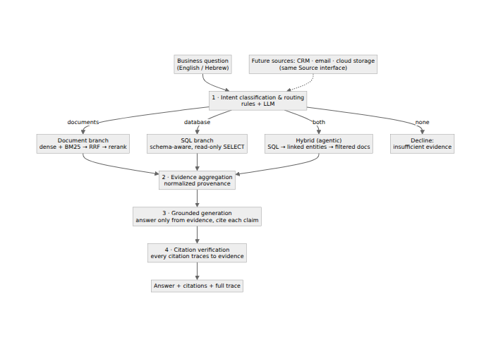
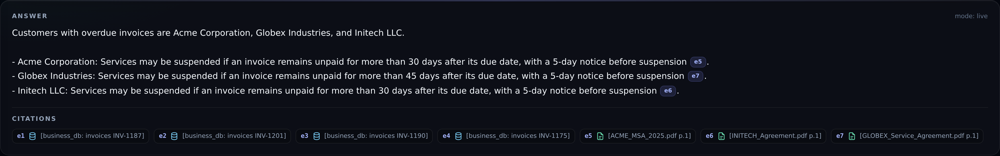
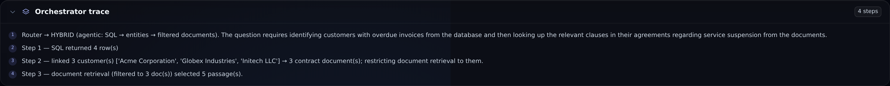
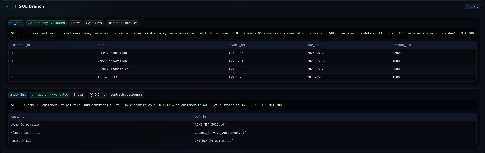
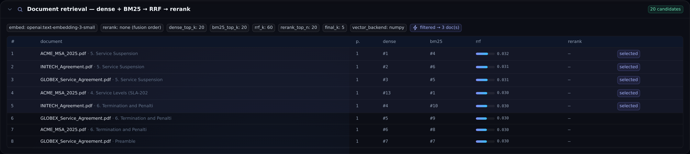
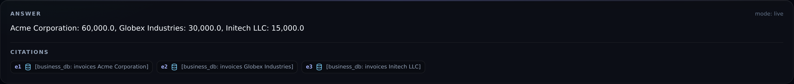
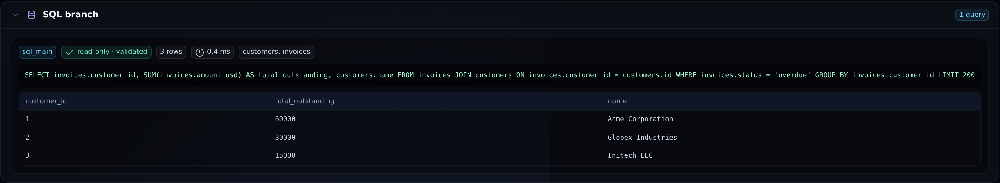
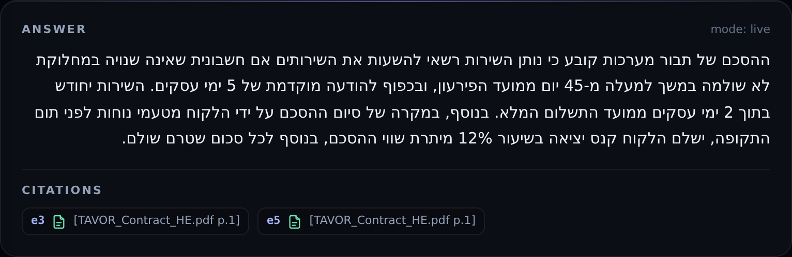
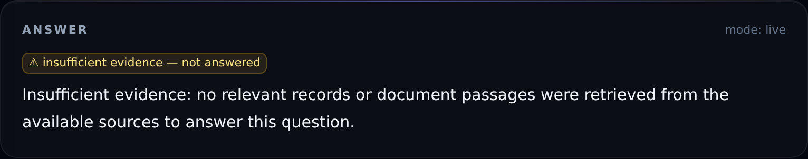

# AI Business Knowledge Assistant — System Overview

A working prototype of a business knowledge assistant that answers free-form questions
by retrieving and combining information across multiple data sources — **PDF documents**
and a **structured database** — and returns a **grounded answer with citations you can
trace back to the exact source**. It works in **English and Hebrew**.

This document walks through what the system does, how it is built, and what each part
looks like in practice, with screenshots from the running application.

---

## What it does

Most "chat with your documents" tools do one thing: embed PDFs and run a similarity
search. That breaks down for real business questions, which usually need **structured
data and documents together** — for example, *"which customers are overdue, and what do
their contracts allow us to do about it?"*

This assistant treats the problem as **retrieval orchestration**. For every question it:

1. **Decides which source(s) are relevant** — the documents, the database, or both.
2. **Retrieves from each appropriately** — semantic + keyword search over documents;
   schema-aware, read-only SQL over the database.
3. **Combines the evidence** and writes an answer that uses **only** that evidence.
4. **Cites every claim** and verifies each citation against what was actually retrieved.

If no source can answer, it says so rather than guessing.

---

## How it works



Every question flows through four stages — routing, retrieval, grounded generation, and
citation verification — and the application exposes all of them for inspection. The
design is source-agnostic: new sources (CRM, email, cloud storage) implement the same
interface and become available to the router without changing the pipeline.

The application surfaces this as a clear pipeline on every answer:


---

## Walkthrough

### 1. A question that spans documents *and* the database

> *"Which customers have overdue invoices, and what do their agreements say about service
> suspension?"*

This cannot be answered by document search alone. The system queries the database for
overdue customers, links each customer to *their specific contract*, retrieves the
relevant clause from only those documents, and writes a combined answer — each line cited
to either a database record or a contract page:



The key point is that **you can see exactly how it reached that answer**. The orchestration
trace shows the actual steps it took:



The database step shows the exact query that ran (validated as read-only before
execution) and the rows it returned:



And the document step shows every candidate passage with its retrieval scores, and which
ones were selected — restricted to just the relevant customers' contracts:



### 2. Asking the database directly

> *"What is the total outstanding invoice amount per customer?"*

The system recognises this as a pure data question, generates a read-only SQL query, and
returns the result with each row cited:





### 3. Working in Hebrew

> *"מה אומר ההסכם של תבור מערכות על השעיית שירות וקנסות?"*
> *("What does the Tavor Systems agreement say about service suspension and penalties?")*

The same pipeline handles Hebrew end to end — it routes the question to the Hebrew
contract, answers in Hebrew with right-to-left formatting, and cites the source:



### 4. Knowing when *not* to answer

> *"What is our employee headcount in Berlin?"*

Nothing in the documents or the database can answer this. Instead of inventing a number,
the system declines:



---

## Why every answer is auditable

The thing that makes this trustworthy for business use is **traceability**. For any
answer, you can open the panel beneath it and see:

- **The routing decision** — why the question went where it did, and how confident the
  system was.
- **The exact SQL** — generated, validated as read-only, and the rows it returned.
- **The retrieval detail** — every candidate document passage with its keyword and
  semantic ranking, and which were selected.
- **The evidence** — each item showing its source document and page, or its database table
  and row.
- **A citation check** — confirming every citation in the answer traces back to retrieved
  evidence.
- **Timing and cost** — how long each stage took and what the answer cost.

Clicking any citation in an answer highlights the exact passage or record it came from.

---

## Extending to other sources

The system is built around a single source interface. The two sources in this prototype —
the contract documents and the business database — implement it, and so would future
**CRM, email, or cloud-storage** integrations. A new source only needs to describe what it
can answer and how to retrieve from it; the routing and answer-generation logic stays the
same. (The repository includes a placeholder CRM connector to illustrate the pattern.)

This means the assistant can grow from two sources to many without re-architecting.

---

## Running it

The whole system runs with a single command:

```bash
docker compose up --build
```

- The application UI is at `http://localhost:3000`.
- It supports any modern LLM provider (it was demonstrated here on OpenAI; it also runs on
  Anthropic, or fully local models), and it can run in a no-key demonstration mode.

The source code, architecture notes, and sample data are in the repository.

---

*Prototype prepared by Apoorv. Sample data is synthetic. Happy to walk through any part of
the architecture or the retrieval logic in more detail.*
